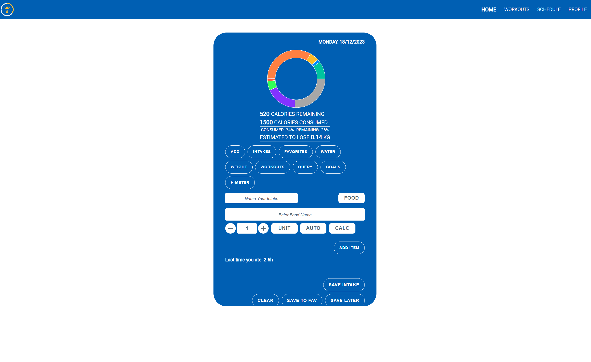
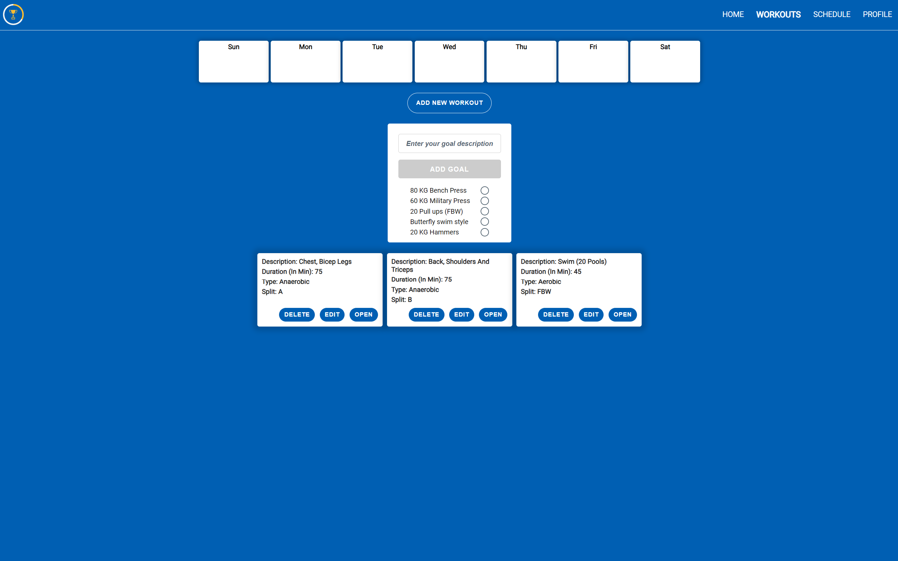
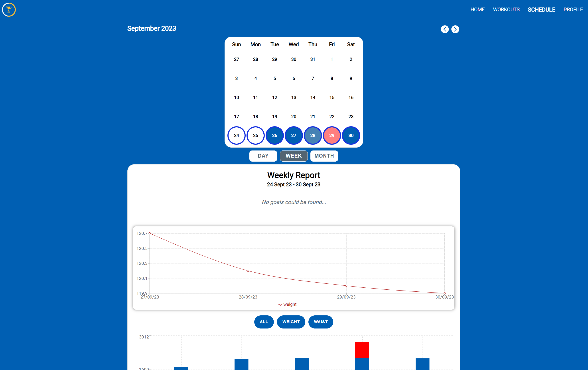
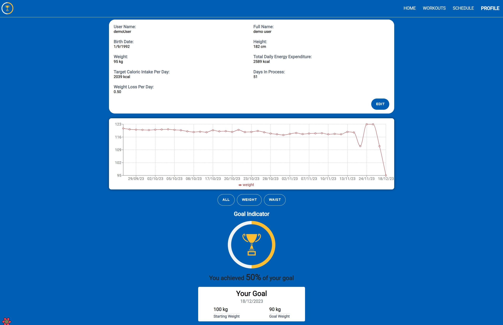

<h1 align="center"> Kceli - Your Weight Loss App! </h1>

<p> Kceli: Elevate Your Weight Loss Experience with Smart Technology. At the heart of Kceli, a cutting-edge React application, lies the commitment to your health and fitness journey. Starting with a calculated Total Daily Energy Expenditure (TDEE), it meticulously tracks your daily calorie consumption using the OpenAI API.

Unique to Kceli is its dynamic calendar interface: it not only vividly alters colors to reflect daily nutritional status but also serves as an insightful hub for detailed daily, weekly, and monthly nutritional reports. This feature-rich calendar allows for effective goal-setting, helping you to stay on track with both short-term and long-term weight loss objectives.

The app transcends mere tracking; it's a tool for proactive health management. The workouts page facilitates the planning, modification, and tracking of exercise routines, and lets you tailor a weekly workout schedule that aligns with your goals.

In the realm of personalization, the profile page offers a visual narrative of your weight loss journey, displaying changes over time through an interactive graph. It's not just about numbers; it's about celebrating milestones. Achieve your set goals, and Kceli rewards you with a vibrant fireworks display, turning your success into a festive moment underscored by Queen's iconic "We Are the Champions."

Kceli is more than an app; it's a companion on your path to a healthier, fitter you.<p>

You can check it out [here ](https://kceli-m8oe.onrender.com/home).



### Table of Contents

- [Application Features](#application-features)
- [Technologies](#technologies)
- [Getting started:](#getting-started)
- [Showcase](#showcase)
- [Author](#author)

## Application Features

- **Total Daily Energy Expenditure Calculation**: Upon signup, Kceli calculates your Total Daily Energy Expenditure (TDEE), providing a personalized starting point for your weight loss journey
- **Caloric Tracking with OpenAI API**: Users can add their daily meals, and Kceli uses the OpenAI API to accurately calculate and track calorie intake, ensuring precise dietary management
- **Dynamic Color-Coded Calendar**: The home page features a calendar that changes color from blue to darker shades to indicate daily nutritional status, providing a quick visual reference of your dietary adherence
- **Detailed Nutritional Reports**: Kceli offers in-depth reports on nutritional intake, broken down into daily, weekly, and monthly summaries, allowing users to monitor and adjust their eating habits effectively
- **Workout Management**: Users can add, edit, and delete workouts on the dedicated workout page, and set a weekly workout schedule, supporting a balanced approach to weight loss
- **Goal Setting and Tracking**: Set and track weight loss goals on a weekly and monthly basis, with Kceli providing the tools and motivation to reach these milestones systematically
- **Interactive Weight Change Graph**: The profile page features an interactive graph showing the total weight changes over time, offering users a visual representation of their progress
- **Celebratory Milestone Features**: When users reach their weight loss goals, Kceli celebrates their achievement with on-screen fireworks and the playing of Queen's "We Are the Champions," adding an element of fun and encouragement
- **User Profile Customization**: Users can edit their personal data in the profile page, tailoring the Kceli experience to their specific weight loss journey and preferences
- **Responsive Design**: Kceli is optimized for various devices, ensuring a seamless and accessible experience across all screens

## Technologies

- React
- TypeScript
- Sass
- Node.js
- Express
- MongoDB
- Mongoose
- Rest API

## Getting started:

- Clone the repository
- Run the following commands to run the backend:

```
$ cd backend
$ npm i
$ npm run dev
```

- Run the following commands to run the frontend:

```
$ cd frontend
$ npm i
$ npm run dev
```

## Showcase

### Home page

The landing page in which the user can start a new day, and add his intakes.


### Workouts page

In the Workouts page, the user can see his workouts, and add new workouts, and edit or delete existing workouts.
Can set his workout schedule, and start a workout that will be saved in the daily data.



### Schedule Page

The Schedule page contains a calendar in which the user can watch the data from the past, and set goals for the future.
The page also contains reports of the user's data, per day, week, month.



### Profile Page

The profile page contains the user data, the total weight lost graph, and the user weight lost goal.



### Author

- [Eshel Eyni](https://github.com/EshelEyni)
